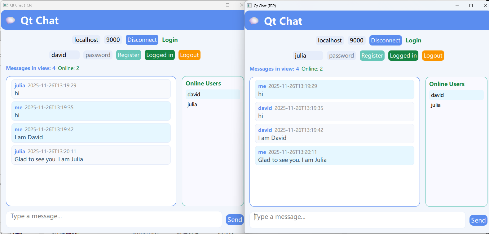

# Qt TCP Chat System

A simple chat system implemented with a C++ backend server and a Qt/QML frontend client. It supports multi-user chat, registration, login, group and private messaging, and shows online user status in real time.

## Features

- **Server features:**
  - Handles multiple TCP clients with Boost.Asio.
  - Supports user registration and login (demo: users and passwords stored in memory).
  - Broadcasting group messages.
  - Sending private (one-to-one) messages.
  - Message history for each user.
  - Online user list with real-time broadcast.
  - Logging with log rotation and configurable log level.
- **Client features (Qt/QML):**
  - Connects via TCP, supports custom server address and port.
  - Register and login UI; current status display.
  - Sends/receives group and private messages.
  - Shows message history and online user list.
  - Provides feedback dialogs for registration and login.
  - Shows warnings for sending messages while logged out.
  - Modern, responsive UI.

## Directory Structure

```
.
├── server/                # C++ backend chat server
│   ├── main.cpp
│   ├── server.cpp/hpp
│   ├── session.cpp/hpp
│   ├── user_store.cpp/hpp
│   ├── message_store.cpp/hpp
│   ├── logger.cpp/hpp
│   ├── protocol.hpp
│   └── CMakeLists.txt
└── client/                # Qt/QML frontend chat client
    ├── main.cpp
    ├── main.qml
    ├── tcpclient.cpp/h
    ├── messagemodel.cpp/h
    ├── qml.qrc
    └── CMakeLists.txt
```

## Build & Run

### Server (C++/Boost):

#### Prerequisites

- CMake ≥ 3.16
- Boost libraries (system, thread)
- nlohmann_json
- C++17 compiler

#### Build steps

```sh
cd server/
mkdir build && cd build
cmake ..
make
```

#### Run

```sh
./chat_server [port]
```
- Default port is `9000`.
- The server creates its log in `logs/server.log`.

#### Log Configuration

You can set environment variables before launching:

- `LOG_FILE` — Path to log file. Default: `logs/server.log`
- `LOG_LEVEL` — Logging level: `debug`, `info`, `warn`, `error`
- `LOG_MAX_SIZE` — Max log file size before rotation (bytes). Default: `10485760`
- `LOG_ROTATE_COUNT` — Number of rotated log files to keep. Default: `5`

### Client (Qt/QML):

#### Prerequisites

- Qt 6 (QtQuick, QtNetwork)
- CMake ≥ 3.16
- C++17 compiler

#### Build steps

```sh
cd client/
mkdir build && cd build
cmake ..
make
```

#### Run

```sh
./qt_chat_client
```

- Adjust server IP/port in UI if not running local.

## Usage Guide

1. **Start the server**
   - Run the server binary. It listens on port 9000 by default.
2. **Start the client**
   - Run the Qt client. Enter the server host/port and connect.
3. **Register and Login**
   - Use username/password fields to register a new user and log in.
4. **Chat**
   - Send messages to all users or privately. Online users and messages are displayed in real time.
5. **Logout / Connection Handling**
   - You can disconnect/reconnect and logout at any time.

## UI Screenshots



## Notes

- For demonstration, passwords are not encrypted and are stored in memory by the server.
- Client and server are designed for simple local/networked testing and learning, not production use.
- On Windows, Boost.Asio uses WinSock2; on Linux, it uses POSIX sockets.

## License

This project is licensed under the MIT License.
